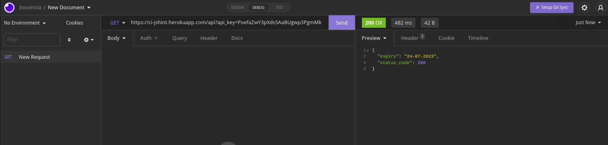
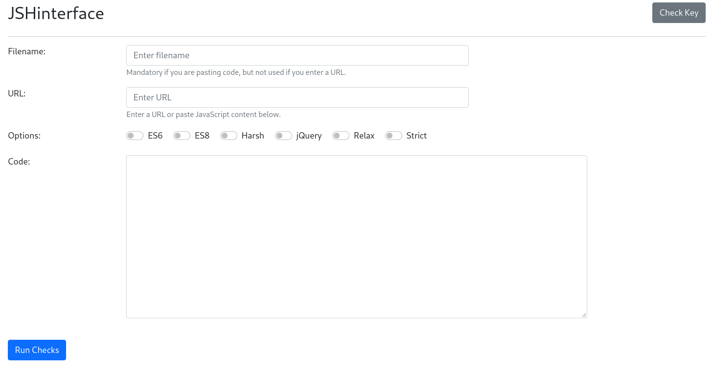

# JSHint GUI

## About
 
Graphical interface to JSHint API provided by Code Institute.
JSHint scans a program written in JavaScript and reports about commonly made mistakes and potential bugs in the code.

API Endpoint is located at https://ci-jshint.herokuapp.com/api

## Functionality
The API provides multiple ways and options to validate JS files:

* filename - a text field containing the name of the file you are checking. Optional if you're passing in a URL

* url - the URL to a JavaScript file that you want to check

* options - a comma separated list of options, which are outlined below.

* code - the JavaScript code you want to check

NOTE: API key in use expires on 24-07-2023.

## Options
* esX - where X is a number: 3,5,6,7,8,9 or 10. This declares what JavaScript version we're checking. Some newer features, like arrow functions, came with ES6.
* harsh - switches on a whole host of restrictive settings, such as enforcing triple equals signs, forcing curly braces around single line code blocks, forcing a trailing comma in objects
* relax - the opposite of strict! Allows functions in loops and doesn't care about semicolons
* strict - expects "use strict"; at the top of the code and lints accordingly
* jquery - switches on jQuery mode so that this code can be checked

## Endpoint test
To test the API make a GET request to the /api endpoint, you need to supply the API key as a GET parameter, like so:

https://ci-jshint.herokuapp.com/api?api_key=thisismykey

If a valid key has been provided, the result will provide the expiry date for the key:

{"expiry":"24-07-2023","status_code":200}

Otherwise an error will be thrown.

I'm using Insomnia API Client https://insomnia.rest/ but same can be done with any browser.

Example:

## Screenshot

## Demo

You can see the app demo here:
https://azelliott.github.io/jshint-api/

